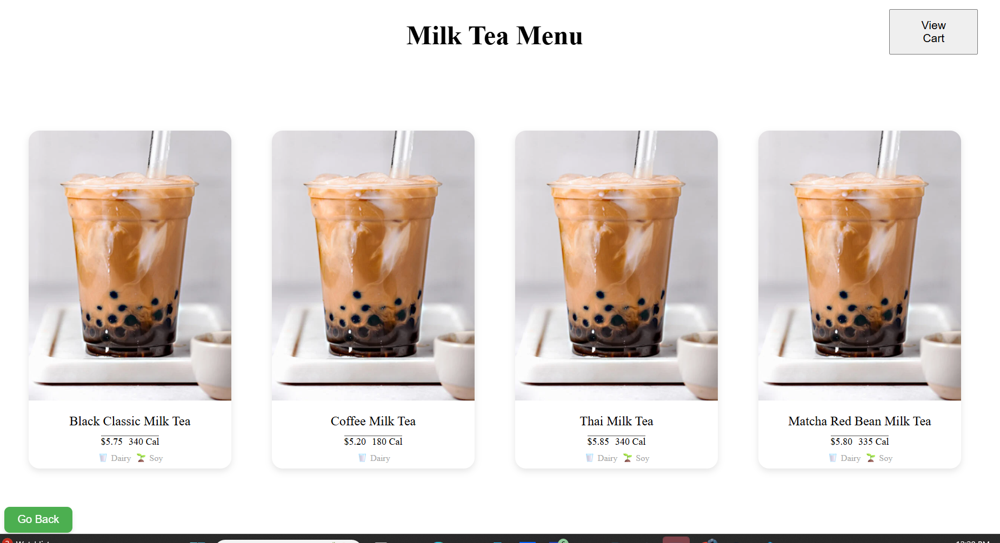
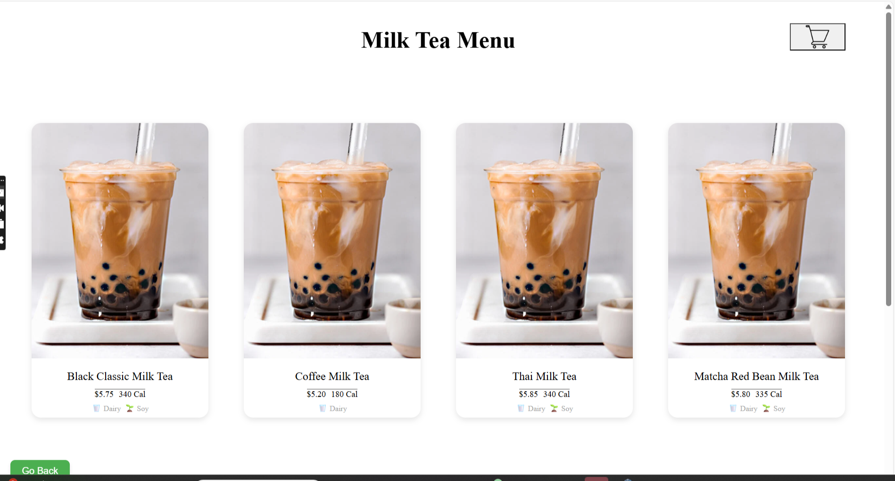
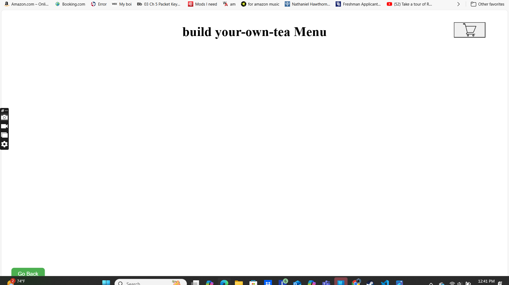
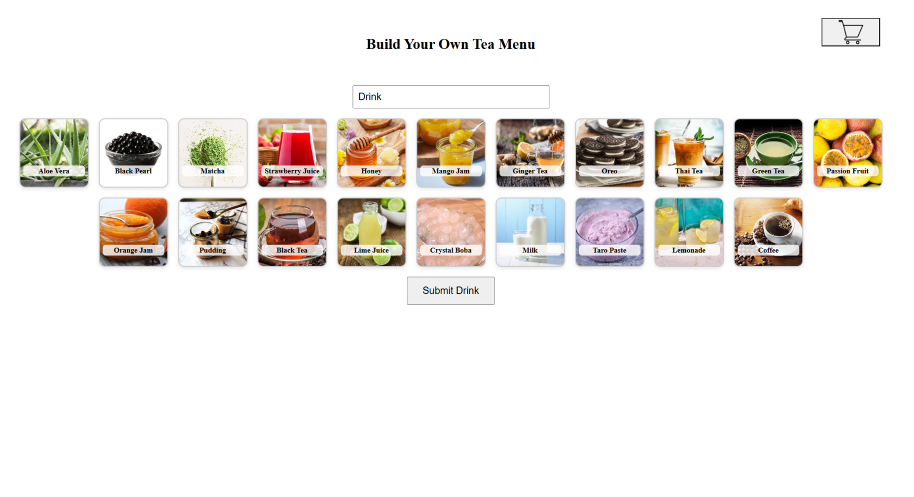
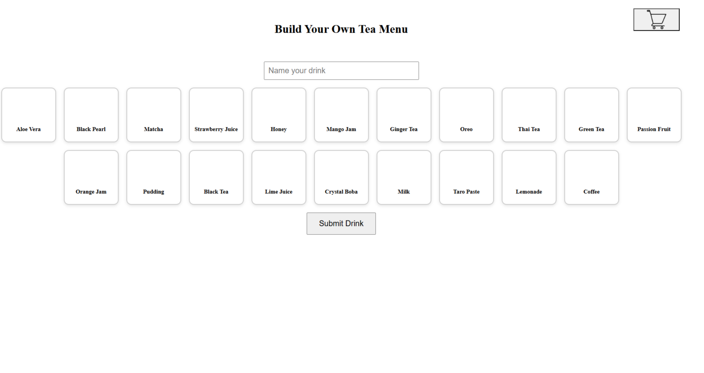

# Bruhba Boba Shop — CSCE 331 Project

A point-of-sale (POS) system developed for a fictional boba tea company, Bobruh Bruhba, as part of a group project for CSCE 331 at Texas A&M University.

This full-stack web application was built by a team of four and includes dedicated interfaces for managers, employees, and customers. The system simulates the core functionality needed to run a real-world boba tea shop, such as menu management, order processing, inventory tracking, and customer customization — with additional features to enhance usability.

---

## Features

### Manager View
- View and update inventory dynamically
- Add or remove drinks, modify pricing, and manage employees
- Access full order history along with X and Z reports for sales summaries
- Includes multiple chart components and placeholders for future feature expansion

### Employee POS System
- Place customer orders through a streamlined, categorized interface
- Optimized for quick interaction and minimal user input
- Tailored for in-store use with fast access to all menu items
- Ability for customers to create their own boba from a list of given ingredients

### Customer Kiosk
- Similar to the employee POS, but enhanced with visual menus and touch-friendly design
- Displays live weather for College Station
- Includes multilingual support via real-time translations
- Works on most modern browsers and touchscreen devices

---

## Screenshots

| Before                                        | After                                       |
| --------------------------------------------- | ------------------------------------------- |
| | |
|  |  |
|  |  |


---

## Tech Stack

- **Frontend:** React.js, 
- **Backend:** Node.js, Express.js
- **Database:** PostgreSQL, pgAdmin4
- **Other Tools:** Chart.js, React Router, dotenv, CORS

---

##  Getting Started

###  Clone the repository
```bash
git clone https://github.com/CSCE331-Spring2025/project3-team53
cd project3-team53

# Install root components
npm install

# Client Installs
cd client
npm install react-router-dom

# Server Installs
cd ../server
npm install cors dotenv express pg

## Run Application
npm start
```
--- 

##  My Contributions (Chris M.) — Frontend Lead
As the Frontend Lead on this project, I was responsible for the structure, layout, and visual styling across the entire user interface. My work spanned all major views, including the customer-facing kiosk, manager dashboard, employee POS, and landing page.

###  Core Frontend Architecture
- Designed and implemented the layout and visual design for:
    - Customer Menu (including BYOT)
    - Manager View (inventory, analytics, reports)
    - Employee POS System
    - Home Page / Landing Page
- Ensured the layout stayed true to what our team wanted among the various website components

###  UI/UX Design & Improvements
- Created reusable React components for drink cards, modals, and UI controls
- Polished styling for accessibility and consistency 
- Designed intuitive flows for creating, customizing, and submitting orders
- Implemented user-friendly visual feedback 

### Frontend Features
- Built the Build Your Own Tea interface with topping selection, live cart preview, and custom naming
- Built other Menu components for the Customers and the Employees
- Integrated weather API and language translation in the customer view
- Enabled touch-friendly controls and ensured cross-browser compatibility

###  Team Collaboration
- Led frontend code organization and file structure to support modular development
- Coordinated with teammates on interface requirements and implementation priorities
- Assisted in debugging UI-related logic involving React state (useState, props)
Note: I was not involved in backend database setup or API implementation.
